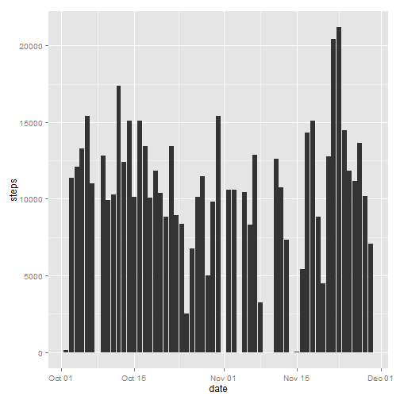
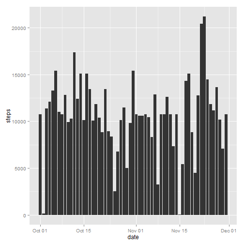
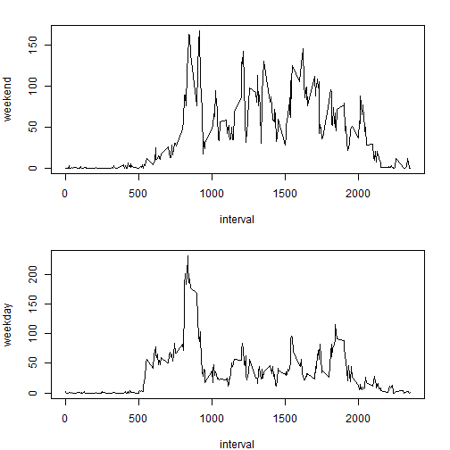

#RepData_PeerAssessment1  

## 1. Load and Process data


```r
library(knitr)
data<-read.csv("activity.csv")
data$date<-as.Date(data$date)
str(data)
```

```
## 'data.frame':	17568 obs. of  3 variables:
##  $ steps   : int  NA NA NA NA NA NA NA NA NA NA ...
##  $ date    : Date, format: "2012-10-01" "2012-10-01" ...
##  $ interval: int  0 5 10 15 20 25 30 35 40 45 ...
```

## 2. The mean total number of steps taken per day


```r
steps_day<-aggregate(steps~date,data,sum) 

library(ggplot2)
qplot(date,steps,data=steps_day,geom="histogram",stat="identity") 
```

 

```r
mean(steps_day$steps,na.rm=TRUE)
```

```
## [1] 10766.19
```

```r
median(steps_day$steps,na.rm=TRUE)
```

```
## [1] 10765
```

## 3. Average Daily Activity Pattern


```r
steps_interval <- aggregate(steps ~ interval, data, mean)
qplot(interval,steps,data=steps_interval,geom="line")
```

 

```r
max<-which.max(steps_interval$steps)
steps_interval$interval[max]
```

```
## [1] 835
```


## 4.Imputing missing values


```r
sum(is.na(data$steps))
```

```
## [1] 2304
```

```r
replacement<-cbind(data,steps_interval)
newdata<-data
newdata$steps[is.na(data$steps)]<-replacement[is.na(data$steps),5]

new_steps_day<-aggregate(steps~date,newdata,sum) 
qplot(date,steps,data=new_steps_day,geom="histogram",stat="identity") 
```

 

```r
mean(new_steps_day$steps)
```

```
## [1] 10766.19
```

```r
median(new_steps_day$steps)
```

```
## [1] 10766.19
```


## Differences in activity patterns between weekdays and weekends


```r
week<-append(rep("weekday", 5 * 288),rep("weekend",2*288))
weekday_weekend<-append(rep(week,8),rep("weekday",5*288))
allweek<-as.factor(weekday_weekend)
data_final<-cbind(newdata,weekday_weekend)

ave1<-aggregate(steps~interval, data=subset(data_final,data_final$weekday_weekend=="weekday"), mean)
ave2<-aggregate(steps~interval, data=subset(data_final,data_final$weekday_weekend=="weekend"), mean)

par(mfrow = c(2, 1),mar=c(4,4,2,2))


plot(ave2$interval, ave2$steps, type = "l", xlab = "interval", 
    ylab = "weekend")
plot(ave1$interval, ave1$steps, type = "l", xlab = "interval", 
    ylab = "weekday")
```

 

